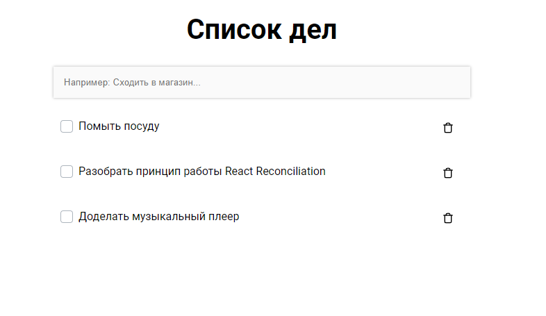

# [RU] Список дел
ReactJS приложение с сохранением задач в localstorage.  

Todo List – это список дел, которые вам нужно выполнить или того, что вы хотите сделать.

<a href="https://stormpero.github.io/Todo-list/" target="_blank">Запустить онлайн</a>
---

# [EN] Todo list
ReactJS application with saving tasks in localstorage.  

Todo List is a list of things you need to do or what you want to do.

## Список дел / Todo list

